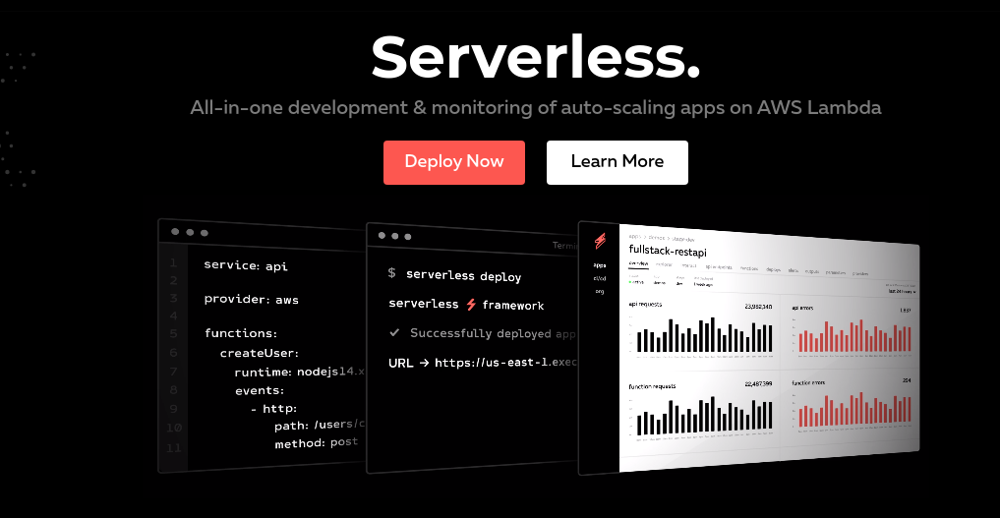
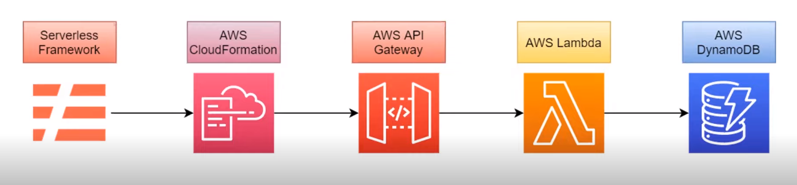

## Serverless e Infraestrutura como Código (IaC) usando o ```Serverless Framework```.

## Serverless Framework - https://www.serverless.com/:

<p align="center"></p>

### Suporte as plataformas: AWS - Azure - GCP e outros...
### Suporte a linguagens: Java - Noje(exmplo desse projeto - JavaScrip) - Python - Ruby - PHP - Go - C# - Swift

## Aquitetura do Projeto:

<p align="center"></p>


